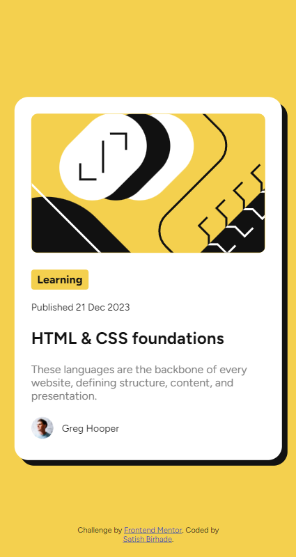

# Frontend Mentor - Blog preview card solution

This is a solution to the [Blog preview card challenge on Frontend Mentor](https://www.frontendmentor.io/challenges/blog-preview-card-ckPaj01IcS). Frontend Mentor challenges help you improve your coding skills by building realistic projects. 

## Table of contents

- [Frontend Mentor - Blog preview card solution](#frontend-mentor---blog-preview-card-solution)
  - [Table of contents](#table-of-contents)
  - [Overview](#overview)
    - [The challenge](#the-challenge)
    - [Screenshot](#screenshot)
      - [Desktop View](#desktop-view)
      - [Mobile View](#mobile-view)
    - [Links](#links)
  - [My process](#my-process)
    - [Built with](#built-with)
    - [What I learned](#what-i-learned)
    - [Useful resources](#useful-resources)
  - [Author](#author)

**Note: Delete this note and update the table of contents based on what sections you keep.**

## Overview

### The challenge

Users should be able to:

- See hover and focus states for all interactive elements on the page

### Screenshot

#### Desktop View


#### Mobile View


### Links

- Solution URL: [https://github.com/SatishB15/blog-preview-card](https://github.com/SatishB15/blog-preview-card)
- Live Site URL: [https://blog-preview-card-sigma-three.vercel.app](https://blog-preview-card-sigma-three.vercel.app/)

## My process

### Built with

- Semantic HTML5 markup
- CSS custom properties
- Flexbox
- CSS Grid
- Mobile-first workflow

### What I learned

```html
<h1>Some HTML code I'm proud of</h1>
 <div class="author">
        
        <p class="author-name">Greg Hooper</p>
      </div>
```
```css
.proud-of-this-css {
      background-color: var(--color-yellow);
    height: 29px;
    width: 82px;
    font-weight: 800;
    border-radius: 4px;
    padding-left: 12px;
    padding-right: 12px;
    padding-top: 4px;
    padding-bottom: 4px;
    display: flex;
    flex-direction: row;
    justify-content: center;
    align-items: center;
    margin-bottom: 16px;
}
```

### Useful resources

- [HTML](https://www.w3schools.com/html/) - The resources on HTML provided by W3Schools were instrumental in helping me understand the structure and semantics of web pages. I particularly appreciated the clear explanations and practical examples, which I will continue to use in future projects.
- [CSS](https://www.w3schools.com/css/) - The comprehensive guide on CSS by W3Schools significantly enhanced my understanding of styling and layout. The detailed tutorials and examples made it easier to grasp complex concepts, and I highly recommend it to anyone looking to improve their CSS skills.

## Author

- Frontend Mentor - [@SatishB15](https://www.frontendmentor.io/profile/SatishB15)
- Twitter - [@BirhadeSatish](https://x.com/BirhadeSatish)
- LinkedIn - [Satish Birhade](www.linkedin.com/in/satish-birhade)
